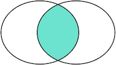
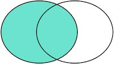
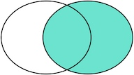

# MySQL多表查询

## 别名
### 为表指定别名

```
SELECT * FROM 表名 [AS] 别名；
```

### 为字段指定别名

```
SELECT 
 [column_1 | expression] AS descriptive_name
FROM table_name;
```

AS关键字是可选的，可以在语句中省略它。注意，你也可以给表达式一个别名

## 交叉查询
> 没有任何限制条件的连接方式”称之为”交叉连接”，”交叉连接”后得到的结果跟线性代数中的”笛卡尔乘积”一样

查询多张表的语法是：`SELECT * FROM <表1> <表2>`


如果我们同时将多张表使用上述语句查询，而且每张表中的数据又比较多，那么可以想象，我们得到结果的时间可能会非常长，而且得到结果以后，可能也没有太大的意义

通过交叉连接的方式进行多表查询的这种方法，我们并不常用，而且我们应该尽量避免这种查询

## 连接查询
### 内连接

#### inner join

我们把tableA看作左表，把tableB看成右表，那么INNER JOIN是选出两张表都存在的记录

```
select a.*, b.* from tablea a
inner join tableb b
on a.id = b.id
```



### 外连接

#### left join

> left join是选出左表存在的记录， 右表不存在的记录填充Null, 这种场景下得到的是A的所有数据，和满足某一条件的B的数据;

```
select a.*, b.* from tablea a
left join tableb b
on a.id = b.id
```




#### right join

> right join是选出右表存在的记录 这种场景下得到的是B的所有数据，和满足某一条件的A的数据；

```
select a.*, b.* from tablea a
right join tableb b
on a.id = b.id
```

