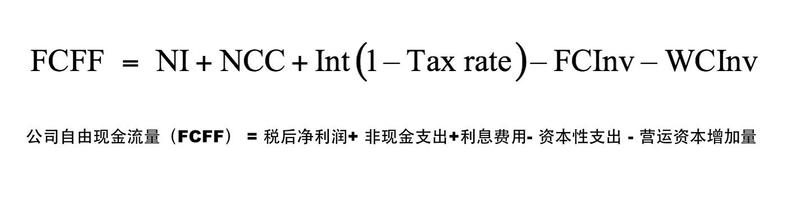
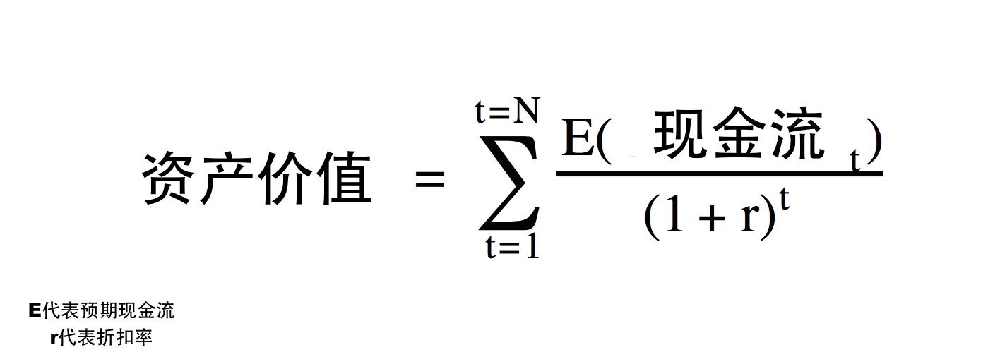

# 常见的公司估值方法

估值方法有各自的优缺点，也有特定的适用范围。估值方法的选择要结合企业具体类型

主要包括两个维度：一是企业所处的生命周期阶段，二是企业所处行业特征

估值是一门艺术，没有绝对答案， 需要注意以下

- 估值方法看似复杂多变，其本质就是未来现金流折现估值
- 对于同一家企业来说，估值方法不是一成不变的
- 估值没有标准答案，如何估值有一定主观性
- 可以采用多个估值指标，增加估值结果的说服力

估值方法一般分为**相对估值法和绝对估值法**两类。

相对估值法是一种乘数法，简单易行，一般有
- PE估值法
- PB估值法
- PS估值法
- PEG估值法
- EV/EBITDA估值法

绝对估值法采用折现的方法，相对复杂，分为
- 现金流折现法
- 股利折现法，


## PE估值法

### PE的内在含义

PE（市盈率，Price Earnings Ratio） 或 P/E

市盈率＝每股市价／每股盈余

PE = Price(每股价格) / EPS(每股收益) = 总市值 / 净利润

> 市盈率表示这家公司的净利润全部用于分红的情况下，收回总投资需要几年

例如：一家公司的市盈率是20，我们投资这家公司（净利润全部用来分红），需要20年收回成本

### PE估值注意的问题
用PE是用历史数据看未来，具有一定的滞后性， 另外不同行业的PE没有可比性
- 扣非净利润更有意义
- 企业盈利不稳定，单一年份盈利很高的情况，导致单一年份的PE很低

### 优点
计算简便，考虑了公司的经营风险和未来收益预期，以及公司、行业的成长性

### 缺点
EPS 受会计报表编制和企业生命周期的变化的影响较大，盈利为负的企业无法使用

## PB估值法

PB（市净率，Price To Book Value）

PB = 每股股价 / 每股净资产  = 总市值 / 总净资产 = P / BPS

### 优点
每股净资产通常为正且相对每股收益更稳定

### 缺点
无法准确衡量无形资产的价值，不适用于净资产规模小的企业，不适用于测算公司成长性

## PS估值法

PS（市销率，Price To Sales）市销率表示公司获得一块钱收入，需要付出的价格, 市销率通常给那些具有成长性，但是'目前没有盈利'的公司估值

PS = P / SPS

### 优点

营业收入指标不会为负值，适用范围较广，销售收入相对净利润和净资产精确度更高

### 缺点

营收不能反映企业创造价值能力，对于成本波动较大的企业预测精度较低

## PEG估值法

PEG（市盈率相对盈利增长比率，G是Grouth增长的意思）

PEG = PE / 未来三五年净利润增速预测值

PEG估值兼顾了企业当下的盈利能力和未来的成长性，一只股票估值要合理，市盈率和未来利润增速应该是匹配的，高增长的股票可以给一个比较高的市盈率

PEG简单说就是数值越小，股价遭低估的可能性越大，这一点和市盈率是一样的

### 优点
更好的考虑了企业的成长性，可以优化对高市盈率企业的估值

### 缺点
忽视企业当前的盈利能力，不能对亏损企业进行估值，企业未来增长率不易准确估计

## 自由现金流折现法(DCF)

自由现金流（Free Cash Flow）是作为一种企业价值评估的新概念、理论、方法和体系， 现金流贴现模型（DCF）把未来特定期间内的预期自由现金流贴现为当前现值

DCF 一般适用于现金流增长相对稳定、可预测度高的企业。此
类企业未来现金流预测难度较小，DCF 可靠性较高。从这个角度来
说，DCF 更适合成长后期及成熟期的企业。但当企业缺乏可比公司
或产品业务缺乏销售及利润数据时，相对估值法基本失效，绝对估值
法成为唯一的可行方法

### 优点
现金流是现代公司经营中关注的重点，通过自由现金流量估计避免了股利带来的问题

### 缺点
现金流和加权平均资本成本的估计都可能会有误差，长期来看贴现率的偏差会对估值造成较大的影响

### 什么是自由现金流
自由现金流，指企业经营活动赚来的钱，去掉那些为了维持企业现有盈利能力必须再投下去的钱后，剩下的部分。它是股东（和债权人）在不伤及企业当前获利能力的前提下，可以从企业拿走的回报，是企业唯一真实的价值



### 投资的本质

现金流折现模型（discounted cash flow model，DCF 模型）旨在通过将所有未来的现金流折成现值来求得资产内在价值（intrinsic value）

```
P0 = (E0CF1)/(1 + r) + (E0CF2)/(1 + r)2 + ... (延续到无限期)
```

P0代表某一企业、资产或工程的现值（当前价值），E0CFn代表当前预测的未来第n期产生的自由现金流，r代表自由现金流的折现率，即资本成本。这一模型的涵义是：一项投资或一个企业的当前价值，等于其未来所产生的现金流的现值之和



**影响计算的参数有三个**
- 即期的企业自由现金流
- 未来自由现金流（FCF）
- 企业的折现率

### 即期的企业自由现金流

自由现金流量（FCF）是指企业息税折旧摊销前利润（EBITDA）减去资本运营净增加额和资本性支出后的可供企业自由支配的现金

我们用企业经营活动产生的现金流量净额与资本性支出的差，来计算出自由现金流量

### 未来的自由现金流如何预估

以基年企业现金流为基础，假设出未来的增长率，来模拟出企业未来的若干年的自由现金流

一般会分为两个阶段或三个阶段来预测, 企业一般会在成长期高速增长，成熟期后增速会下降，到最后阶段就会出现低增长甚至不增长。

比如两阶段模型 = 前5-10年的自由现金流总和 + 后续经营价值。这里需要两个增长率，一个5-10年的高增长率，一个后续的低增长率，未来每年的现金流就等于上一年数据×这个增长率。

**增长率取决于你对未来经济发展、行业周期、企业成长与竞争能力的判断。**

### 折现率

假设出一个钱贬值的速度，对未来每年赚到的钱进行折现，所对应的就是今天的价值

折现率该假设多少取决于你期望的回报率，并与风险相匹配。

一般会采用企业的加权平均资本成本（WACC），也可以采用通货膨胀率。 这没有一个准确的答案，所以DCF的计算其实不准的

## 企业价值倍数(EV / EBITDA)

企业价值倍数（EV/EBITDA，也称EBITDA倍数）是众多估值法当中的一种，是一家公司企业价值相对其年度EBITDA（可以是历史数据也可以是预测或估算数据）的财务比率，通常用于确定一家公司的价值以及同类型公司之间的价值比较

一家公司的企业价值倍数提供了一个资本结构、税收和固定资产差异的标准化率。

企业价值倍数的计算公式是EV/EBITDA，其中EV指的是企业价值（市值+净负债），具体的计算公式为：

**企业价值 =（市值 + 负债 + 少数股东权益 + 优先股）﹣（现金及现金等价物）**

**EBITDA指的是税息折旧及摊销前利润 = 税前盈利 + 利息 + 折旧 + 摊销**

EV/EBITDA最厉害的地方就是它既包含的股东的收益（分母EBITDA中）和股权市值（分子EV中），也包含了债权人收益（分母EBITDA中）和债权市值（分子EV中）。而P/E只包含了股东的收益（分母E中）和股权市值（分子P中），并没有债权人的那一部分。也就是说EV/EBITDA的计算中考虑到了企业不同的杠杆水平

**在杠杆大的行业（或者说杠杆率大小不一的行业），比如电信，能源等，使用EV/EBITDA估值要比P/E更准确**

### 优点

企业价值倍数的一个重要特征是将负债和所有者权益都纳入估值核算中，因而能够更全面的反映一家公司的经营业绩。

这一估值技术广泛应用于企业并购中，企业价值倍数低的公司有可能是一个优质的收购标的。对于上市公司来说，企业价值倍数平均在8左右，不同行业会有高低，非上市公司通常更低，一般都接近4左右。

投资者可以使用一家公司的企业价值倍数来评估该公司是被高估还是被低估。如果这一比率低，该公司可能被低估，相反，如果比率高，可能是高估信号

### 缺点
和P/E比较起来，EV/EBITDA方法要稍微复杂一些，至少还要对债权的价值以及长期投资的价值进行单独估计。

其次，EBITDA中没有考虑到税收因素，因此，如果两个公司之间的税收政策差异很大，这个指标的估值结果就会失真


