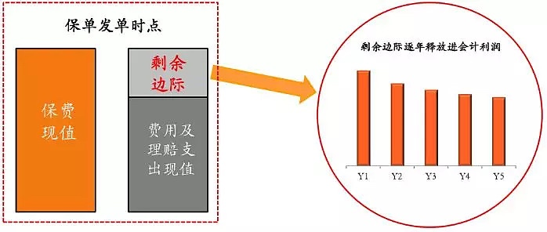
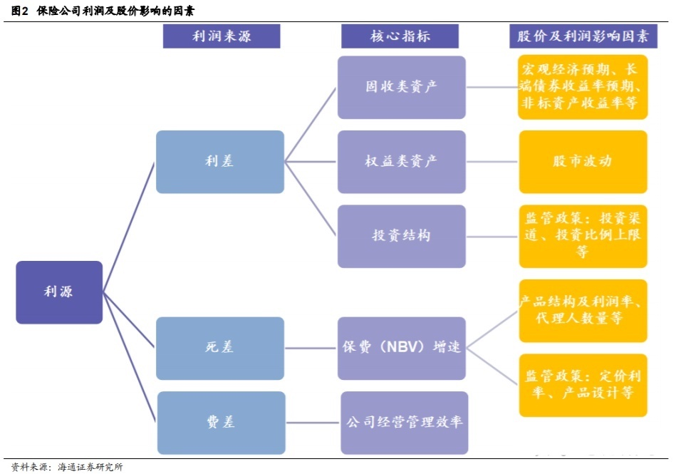
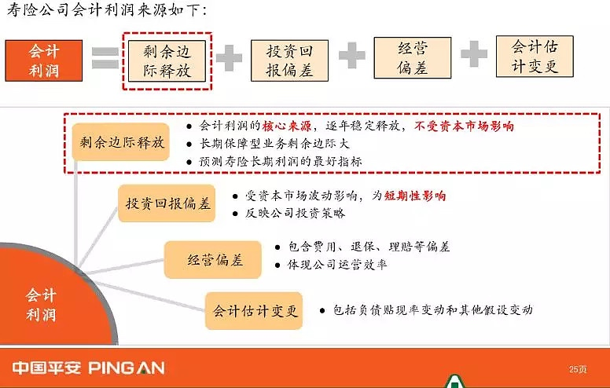

# 保险

## 什么是保险

保险是指投保人根据合同约定，向保险人支付保险费，保险人对于合同约定的可能发生的事故因其发生所造成的财产损失承担赔偿保险金责任，或者被保险人死亡、伤残、疾病或者达到合同约定的年龄、期限等条件时承担给付保险金责任的商业保险行为。

## 保险的种类

按照保险保障范围分为：
- **人身保险**
    - **人寿保险**: 指被保险人在保险责任期内生存、死亡或达到合同约定的年龄、期限时，保险人按照合同约定给付保险金的保险
        - 定期寿险
        - 终身寿险
        - 两全寿险
        - 年金保险
        - 投资连结保险
        - 分红寿险和万能寿险等
    - **健康保险:** 健康保险是指被保险人在保险有效期内，因疾病或意外事故而致伤、病且造成费用或损失时，保险人按照合同约定给付保险金的保险
        - 医疗保险
        - 疾病保险
        - 收入补偿保险
    - **意外伤害保险:**  指被保险人在保险有效期间，因遭遇非本意的、外来的、突然的意外事故，致使其身体遭受伤害而残疾或死亡时，保险人按照合同约定给付保险金的保险
        
- **财产保险**
    - **财产损失保险：** 以各类有形财产为保险标的的保险
        - 企业财产保险
        - 家庭财产保险
        - 运输工具保险
        - 货物运输保险
        - 工程保险
        - 特殊风险保险
        - 农业保险等种类
    - **责任保险：** 以被保险人对第三者的财产损失或人身伤害依照法律应负的赔偿责任为保险标的的
        - 公众责任保险
        - 产品责任保险
        - 雇主责任保险
        - 职业责任保险等
    - **信用保险：** 以各种信用行为为保险标的的保险
        - 一般商业信用保险
        - 出口信用保险
        - 合同保证保险
        - 产品保证保险等

## 剩余边际

剩余边际 = 保单所有年度保费的贴现值 - 保单所有年度费用和理赔支出的贴现值

如果剩余边际为负数，表示卖出这份保单是亏损的，如果剩余边际为正数，表示卖出这份保单是赚钱的，是有利润的

### 剩余边际摊销

因为保单产生的赔偿责任在整个保单生效期均有效，根据会计的权责发生原则，保单产生的利润应该在保单期间逐步释放。剩余边际（保单利润）释放的过程，就是剩余边际摊销的过程

剩余边际本质上是负债，随着摊销进程，负债减少，转化成利润，最终成为股东权益

## 寿险的利润来源

对于寿险业务来说，主要有三个利润来源，就是业内常说的三差：
- 死差: 因实际死亡人数与预定死亡人数之间的差异而产生的损益
- 利差: 把钱拿出去投资各种项目赚的钱 减去 给你的利息
- 费差: 在内部管理，内部运营过程中省下的钱

