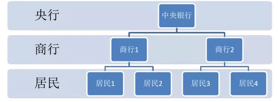
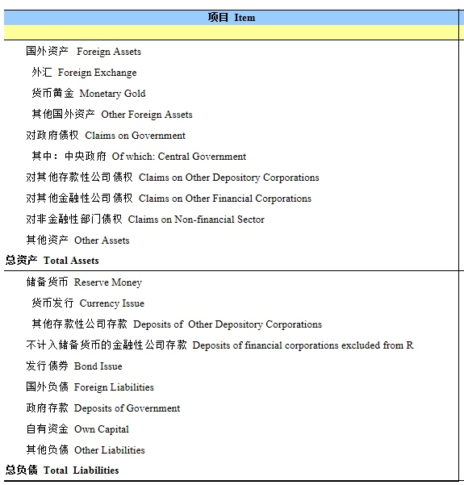
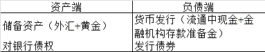
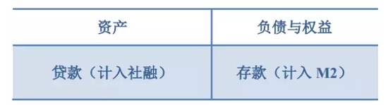

# 货币社融和信贷

## 货币

### 货币是怎么产生的

在现代信用货币制度下，货币当然是央行“印”的。

**一般来说，央行主要通过商业银行投放货币。**

**第一种情况：外汇流入，央行资产项下外汇储备增加，对应一笔货币发行增加**

- 当国内企业获得对外贸易盈余/国外企业需要到中国投资时，需要将外汇例如美元，兑换成为人民币。

- 这个过程实际上是：企业/个人向商业银行结汇，商业银行统一向央行结汇。企业和个人向商业银行结汇过程并不涉及货币发行（钱仍然在实体），而商业银行向央行结汇则涉及到货币发行。商业银行将外汇交给央行换取人民币

- 在央行资产负债表上体现为：央行外汇储备资产（资产端）增加，同时从印刷厂“借出”一批崭新的人民币，记为货币发行项下——其他存款性公司存款（即商业银行存在央行的钱，也叫做准备金，派生过程按下另表）。简化一下：外汇流入，央行资产项下外汇储备增加，对应一笔货币发行增加。

**第二种情况： 央行借钱给银行**

- 但是随着人民币贬值预期提升，外汇开始持续流出，第一种情形不再是主要的货币投放渠道。那么就依靠第二种货币投放渠道——央行借钱给银行。

- 央行通过公开市场操作，借给银行一笔钱并规定还款期限，这种工具可以是逆回购/MLF/SLF等等等等各种花样百出的工具。在央行资产负债表上体现如下：资产端对银行债权增加，负债端体现为货币发行项下——银行（超额）存款准备金上升，对应货币发行。

**这意味着什么？每一笔发行出去的人民币都是央行的负债，一定要有对应的资产，才能有应货币发行。** 

这个过程，发行的货币在央行资产负债表科目下体现为货币发行，用金融学术语是基础货币，也叫高能货币

央行通过各种手段控制货币总量，从而间接调节经济，这些手段统称为货币政策。

这个机制是建立在目前的“二级银行体制”上的。

### 二级银行体制

所谓二级银行体制，就是一个国家由央行成为一级银行，而商业银行（存款货币银行）是二级银行，商业银行在央行那里开户，民居（企业和个人）在商业银行那里开户。

在二级银行体制下，央行是银行的银行。

发行货币时，央行先向银行投放基础货币（比如一次放贷款行为，即再贷款），形成银行在央行账户里的“存款”（准备金）。基础货币还不是我们手上流通的货币。银行再把这些基础货币投放给居民（比如发放贷款），于是就在居民的账户里形成存款，这才是我们的货币（计入M2）。所以，这里有两个动作，先是央行向银行投放基础货币，然后是银行向居民投放M2。

**所以，货币是通过放贷来派生。**

由于央行通过控制基础货币、存款准备金来间接控制广义货币总量的。然后，货币总量又作用于经济。可见，央行调节经济的行为，是非常“间接”的。传导链条太长，总是会出现各种差池。

比如，存款准备金率是20%，但银行不会把其余80%全拿去放贷，总得留点钱作别的用途，所以可能是拿70%的钱去放贷。所以，货币乘数会小于5。

　　更严重的情况是，如今经济不景气时，有些国家最常遇到的一个问题是：虽然存款准备金率是20%，但银行拿去放贷的钱远远小于70%，甚至只有50%。因为经济太差了，银行不敢投放信贷（只敢给少数优质客户投放信贷），怕投了收不回来。这时，哪怕央行再怎么投放基础货币，再怎么降低存款准备金率，也无济于是。二级银行体制的货币派生渠道失效了，其根源是因为银行毕竟是自负盈亏的经营主体

### 央行能顺便印钱吗？
答案是否定的。央行有一张资产负债表，货币发行（印钱），位于央行的负债端，每一笔负债，是有明确对应的资产的。以下是中国人民银行官网公布的央行资产负债表：

简化一下央行的资产端和负债端

[央行公布的金融数据](http://www.pbc.gov.cn/diaochatongjisi/116219/116225/index.html)

## M0 M1 M2

**中国大陆的定义**

- M0 流通中的现金 = 流通中现金
- M1 货币 = M0＋可开支票进行支付的单位活期存款
- M2 货币和准货币 = M1＋居民储蓄存款＋单位定期存款＋单位其他存款＋证券公司客户保证金

区分他们三兄弟的标准就是：资金的流动性强弱。

其中M0是流动性最强的，叫做流通中的现金主要跟消费紧密相关；

M1的流动性其次，M1=M0+一些活期存款（流动性比现金弱）+信用卡的循环额度（流动性比现金弱），这个就叫做狭义货币供给；

M2=M1+企业事业单位的存款（流动性比活期存款还弱）+居民存款。

**M2反映的是社会对于货币的总需求的变化，我们通常所说的货币供给也就是M2**

### M0

流通中现金

> 是指流通于银行体系以外的现钞，也就是居民和企业手中的现钞。Mo虽然是货币家族的老么，但最机灵，流动性最强，具有最强的购买力

### M1

M0 + 商业银行活期存款，称为狭义货币供应量

> 由流通于银行体系以外的现钞（M0）和银行的活期存款构成。其中活期存款由于随时可以变现（提取），所以流动性和购买力不亚于现钞。Ml是货币家族的老二，代表了一国经济中的现实购买力，因此，对社会经济生活有着最广泛和最直接的影响。许多国家都把Ml 作为调控货币供应量的主要对象

### M2

M1 + 商业银行定期存款，称为广义货币供应量

>  由流通于银行体系之外的现钞加上活期存款（M1），再加上定期存款、储蓄存款等构成。M2是货币家族的老大，包括了一切可能成为现实购买力的货币形式。定期存款、储蓄存款等不能直接变现，所以不能立即转变成现实的购买力，但经过一定的时间和手续后，也能够转变为购买力，因此，它们又叫做“准货币”。

## 社融
所谓社融，指的是社会融资总量，就是金融业对实体经济的年度新增融资总量，既包括银行体系的间接融资，又包括资本市场的债券、股票等市场的直接融资。

社会融资规模的内涵主要体现在三个方面

- 一是金融机构通过资金运用对实体经济提供的全部资金支持，即金融机构资产的综合运用，主要包括人民币各项贷款、外币各项贷款、信托贷款、委托贷款、金融机构持有的企业债券、非金融企业股票、保险公司的赔偿和投资性房地产等。

- 二是实体经济利用规范的金融工具、在正规金融市场、通过金融机构服务所获得的直接融资，主要包括银行承兑汇票、非金融企业股票筹资及企业债的净发行等。

- 三是其他融资，主要包括小额贷款公司贷款、贷款公司贷款、产业基金投资等。

**从公式来看：社会融资规模=人民币贷款+外币贷款+委托贷款+信托贷款+未贴现银行承兑汇票+企业债券+非金融企业境内股票+投资性房地产+其他**

央行是每个季度发布社会融资规模这一数据，是成为未来货币政策制定过程中的一个重要参考指标

### M2和社融的关系

M2是负债端，反映的是存款性公司（包括中国人民银行和银行业存款类金融机构。其中银行业存款类金融机构包括银行、信用社和财务公司）的资产负债表中的负债端。M2是存款性公司负债方的最主要构成部分，在总负债中的占比一般超过了80%

**新增贷款应属于社会融资规模的部分，同时新增贷款又是银行资产负债表中的资产端，资产与负债是相对应的，资产=负债+所有者权益，由等量关系，M2与新增贷款存在一定正相关，但相关系数就不好确定了。**

社会融资规模与M2分别代表了金融体系的资产方和负债方，是一个硬币的两面，两者从不同方面反应了货币政策传导的过程，两者之间是相互补充、相互印证的关系，但具有不同的经济含义。

**社会融资规模与M2的不同之处主要有以下五点：**

- 社会融资规模从金融机构资产方进行统计，而M2从负债方进行统计；

- 社会融资规模统计的是整个金融机构（包括银行、证券、信托、保险等），而M2仅从存款性金融机构（包括银行、信用社和财务公司）进行统计；

- 社会融资规模涵盖的资产范围更广，除了金融机构的贷款，还包括金融机构的表外业务及金融市场的债券、股票融资等，而与M2对应的资产端主要是存款性金融机构的贷款；

- 社会融资规模指标兼具总量和结构两方面信息，不仅能反映实体经济从金融体系获得的资金总额，还能反映资金的流向和结构，而M2指标是一个总量指标；

- 社会融资规模反映的是金融体系对实体经济的支持，而M2反映的是金融体系向社会提供的流动性，体现了全社会的购买力水平。

## 信贷

- 借款企业第一次向这家银行贷款，就叫新增贷款。

- 假如贷款到期了，企业正常偿还了这笔贷款后，再次向银行申请贷款，这样还叫新增贷款。

- 假如贷款到期了，企业不能正常偿还这笔贷款，先银行提出再借第二笔贷款用以偿还第一笔贷款的话，叫借新还旧。

银行每一次放贷派生M2，就是一次融资行为，同时形成社融余额和M2余额。这两个指标处于银行资产负债表的两边：

从这个意义上讲，贷款几乎是惟一的融资渠道，又几乎是惟一的M2派生渠道，那么信贷、M2和社融三者几乎是相近的，仿佛是会计科目的借贷两边，金额相等

**随着金融体系的多元化，三者出现偏离，主要有：**

- 非信贷的M2派生渠道增多，比如银行通过购买企业债券、投放非标的方式给企业融资，形成M2。但此时，信贷、债券、非标都计入社融里，所以M2和社融依然相近，但信贷会低于M2和社融。

- 非派生而来的M2增多，比如外汇占款直接投放M2。此时，M2高出了信贷和社融。

- 直接融资增加，计入社融，但完全不影响信贷和M2，因为直接融资不会派生M2（是存量M2的转移）。此时，社融就高过了信贷和M2。

　最后，形成了信贷< M2，信贷<社融的局面。而M2与社融的大小比较，则取决外占和直接融资的比较。
　
### 融资结构

现在派生M2的方法很多，信贷、银行购债、银行放非标等均可。同样派生100块钱的M2，不同方法，对融资者有不同的影响。

因为，不同类型的主体，会适应不同的融资工具。比如，

- 中小企业普遍使用贷款，
- 大中型企业倾向使用债券等。
- 还有些不那么“合规”的融资主体，比如受限期间的房地产企业、地方政府融资平台，则使用非标等。

这些工具都具有派M2功能，如果央行关注M2总量，任由银行自行选择派生渠道，则有可能出现结构失衡，某些渠道泛滥而某些渠道干涸，这意味着某些类型的主体撑死，另一些则渴死

### 不增加M2的融资方式

- 直接融资（股票、债券、信托等，但由银行自有资金购买的除外）
- 表外融资（银行承兑汇票）

可以调节M2/GDP的比例 新兴产业则多适合用直接融资，其中又以股权融资为主， 直接融资比例会上升，M2/GDP也就会下降

社融和M2不一样，不仅仅是总量问题，还有结构问题， 保持合理的融资结构很重要