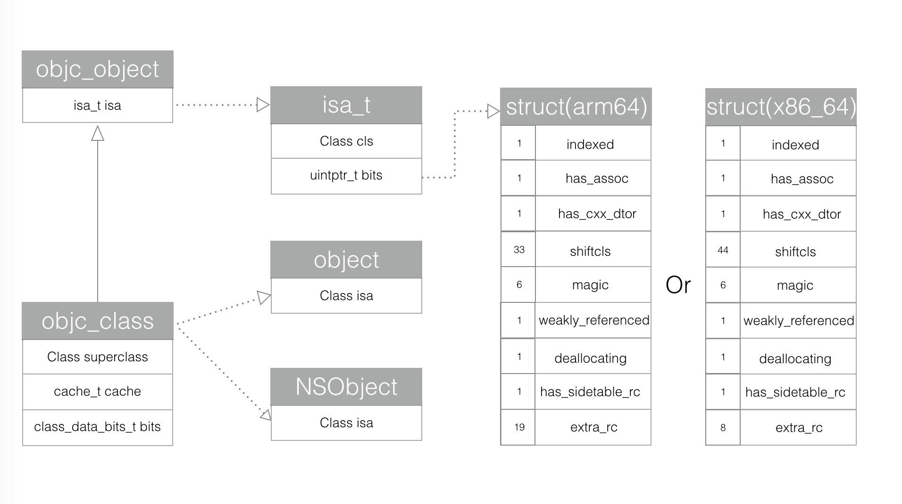

# isa和Class

## 什么是isa

在OC中我们有时会用`id`来声明对象， 那么`id`的本质是什么？

打开 `#import<objc/objc.h>` 的源文件，可以找到`id`的定义

```
/// An opaque type that represents an Objective-C class.
typedef struct objc_class *Class;

/// Represents an instance of a class.
struct objc_object {
    Class isa  OBJC_ISA_AVAILABILITY;
};

/// A pointer to an instance of a class.
typedef struct objc_object *id;
```

上述代码发现我们常用的id也就是`struct objc_object`结构体的指针

这个结构体只有一个成员变量，这是一个`Class`类型的变量`isa`，也是一个结构体指针`objc_class`

```
struct objc_class {
    Class isa  OBJC_ISA_AVAILABILITY;

#if !__OBJC2__
    Class super_class                                        OBJC2_UNAVAILABLE;
    const char *name                                         OBJC2_UNAVAILABLE;
    long version                                             OBJC2_UNAVAILABLE;
    long info                                                OBJC2_UNAVAILABLE;
    long instance_size                                       OBJC2_UNAVAILABLE;
    struct objc_ivar_list *ivars                             OBJC2_UNAVAILABLE;
    struct objc_method_list **methodLists                    OBJC2_UNAVAILABLE;
    struct objc_cache *cache                                 OBJC2_UNAVAILABLE;
    struct objc_protocol_list *protocols                     OBJC2_UNAVAILABLE;
#endif

} OBJC2_UNAVAILABLE;
/* Use `Class` instead of `struct objc_class *` */
```




`struct objc_classs`结构体里存放的数据称为元数据(`metadata`)通过成员变量的名称我们可以猜测里面存放有指向父类的指针、类的名字、版本、实例大小、实例变量列表、方法列表、缓存、遵守的协议列表等，这些信息就足够创建一个实例了

该结构体的第一个成员变量也是`isa`指针，这就说明了`Class`本身其实也是一个对象，我们称之为类对象

