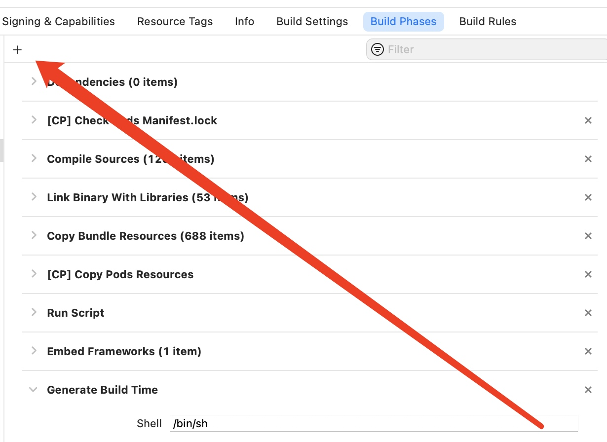

# Xcode运行脚本


> run script in build phases： 脚本几乎和shell脚本一样，位置在Xcode的Build Phases配置中添加，属于build阶段，默认会在系统自动build之后，installing app之前执行。

## Xcode脚本获取打包时间
### 操作步骤
1. 在Xcode的Build Phases中点击添加脚本
    
2. 在项目的文件夹中创建 buildInfo.plist，并添加以`BuildTime` 为key的字段
3. 在脚本输入框中输入以下代码
    
    ```
    #!/bin/sh
    
    set -e
    
    # plist 文件地址
    
    PLIST_PATH="./ProjectName/buildInfo.plist"
    
    BUILD_TIME_KEY=":BuildTime"
    
    BUILD_TIME_VALUE="打包时间:$(date +%m月%d日%H时%M分%S秒)"
    
    if [ -r "${PLIST_PATH}" ]; then
    
        /usr/libexec/PlistBuddy -c "Set ${BUILD_TIME_KEY} ${BUILD_TIME_VALUE}" "${PLIST_PATH}"
    
    else
    
        /usr/libexec/PlistBuddy -c "Add ${BUILD_TIME_KEY} string ${BUILD_TIME_VALUE}" "${PLIST_PATH}"    
    
    fi
    
    ```
4. 在代码中读取打包的时间
     ```
     NSString *filePath = [[NSBundle mainBundle] pathForResource:@"buildInfo" ofType:@"plist"];
    NSDictionary *dict = [NSDictionary dictionaryWithContentsOfFile: filePath];
    NSString *buildTime = dict[@"BuildTime"];
    ```
    
## 每次构建的时候build号自增 

添加如下shell脚本
```
if [ $CONFIGURATION == Release ]; then
    echo "当前为 Release Configuration,开始自增 Build"
    plist=${INFOPLIST_FILE}
    buildnum=$(/usr/libexec/PlistBuddy -c "Print        
    CFBundleVersion" "${plist}")
if [[ "${buildnum}" == "" ]]; then
    echo "Error：在Plist文件里没有 Build 值"
    exit 2
fi
    buildnum=$(expr $buildnum + 1)
    /usr/libexec/PlistBuddy -c "Set CFBundleVersion 
    $buildnum" "${plist}"
else
    echo $CONFIGURATION "当前不为 Release 
    Configuration"
fi
```

