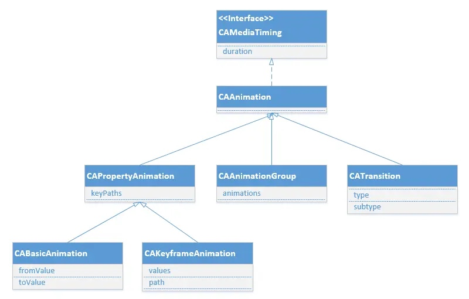

### iOS基础动画 

iOS开发动画的主要使用的Core Animation 。Core Animation的动画执行过程是在后台操作的.不会阻塞主线程。 Core Animation是直接作用在CALayer上的，并非UIView

### 动画操作过程

1. 创建一个CAAnimation对象
2. 设置一些动画的相关属性
3. 给CALayer添加动画（addAnimation:forKey: 方法）
4. 移除CALayer中的动画（removeAnimationForKey: 方法）

### 核心动画类

CAAnimation是所有动画对象的父类，实现CAMediaTiming协议，负责控制动画的时间、速度和时间曲线等等，是一个抽象类，不能直接使用。



#### CAAnimation的子类

* CABasicAnimation  基础动画
* CAKeyframeAnimation  关键帧动画
* CATransition 转场动画
* CAAnimationGroup 组动画
* CASpringAnimation 弹性动画 （iOS9.0之后，它实现弹簧效果的动画，是CABasicAnimation的子类。）

### CAMediaTiming协议

CAAnimation的子类都实现CAMediaTiming协议， 该协议有以下属性

```
@property CFTimeInterval beginTime;

@property CFTimeInterval duration;

@property float speed;

@property CFTimeInterval timeOffset;

@property float repeatCount;

@property CFTimeInterval repeatDuration;

@property BOOL autoreverses;

@property(copy) CAMediaTimingFillMode fillMode;
```

### CAPropertyAnimation

`CAPropertyAnimation` 继承 `CAAnimation`, 他有一个`keyPath`属性

keyPath：通过指定CALayer的一个属性名做为keyPath里的参数(NSString类型)，并且对CALayer的这个属性的值进行修改，达到相应的动画效果。比如，指定@”position”为keyPath，就修改CALayer的position属性的值，以达到平移的动画效果。

```
CAPropertyAnimation *animation = [CAPropertyAnimation animationWithKeyPath:@"position.y"];
[self.view.layer addAnimation:animation forKey:@"position_y"];
```

**animationWithKeyPath值的总结**

| 值                       | 说明                  | 使用形式                                                         |
|-------------------------|---------------------|--------------------------------------------------------------|
| transform.scale         | 比例转化                | @(0.8)                                                       |
| transform.scale.x       | 宽的比例                | @(0.8)                                                       |
| transform.scale.y       | 高的比例                | @(0.8)                                                       |
| transform.rotation.x    | 围绕x轴旋转              | @(M_PI)                                                      |
| transform.rotation.y    | 围绕y轴旋转              | @(M_PI)                                                      |
| transform.rotation.z    | 围绕z轴旋转              | @(M_PI)                                                      |
| cornerRadius            | 圆角的设置               | @(50)                                                        |
| backgroundColor         | 背景颜色的变化             | [id](UIColor purpleColor).CGColor                            |
| bounds                  | 大小，中心不变             | [NSValue valueWithCGRect:CGRectMake(0, 0, 200, 200)];        |
| position                | 位置(中心点的改变)          | [NSValue valueWithCGPoint:CGPointMake(300, 300)];            |
| contents                | 内容，比如UIImageView的图片 | imageAnima.toValue = [id](UIImage imageNamed:@"to").CGImage; |
| opacity                 | 透明度                 | @(0.7)                                                       |
| contentsRect.size.width | 横向拉伸缩放              | @(0.4)最好是0~1之间的                                              |

### CABasicAnimation 基础动画

```
@interface CABasicAnimation : CAPropertyAnimation

@property(nullable, strong) id fromValue;
@property(nullable, strong) id toValue;
@property(nullable, strong) id byValue;

@end
```

fromValue : keyPath相应属性的初始值

toValue : keyPath相应属性的结束值，到某个固定的值（类似transform的make含义）

构建一个基础动画

```
CABasicAnimation *animation = [CABasicAnimation animation];
animation.keyPath = @"position";
animation.toValue = [NSValue valueWithCGPoint:CGPointMake(100, 100, 50, 50)];
animation.duration = 0.5;
animation.fillMode = kCAFillModeForwards;
animation.removedOnCompletion = NO;
[self.view.layer addAnimation: animation forKey:@"position"];

```

### CAKeyframeAnimation 关键帧动画

```
@interface CAKeyframeAnimation : CAPropertyAnimation

@property(nullable, copy) NSArray *values;

@property(nullable) CGPathRef path;

@end
```

每个点连起来的线就是动画轨迹，每个点有对应的位置，对应的时间点。

keyTimes：可以为对应的关键帧指定对应的时间点,其取值范围为0到1.0，keyTimes中的每一个时间值都对应values中的每一帧的时间节点的百分比，当keyTimes没有设置的时候,各个关键帧的时间是平分的

path：可以设置一个CGPathRef、CGMutablePathRef，让层跟着路径移动，path只对CALayer的anchorPoint和position起作用，如果设置了path，那么values、keyTimes将被忽略。

```
//设置动画属性
CAKeyframeAnimation *animation = [CAKeyframeAnimation animationWithKeyPath:@"position"];
NSValue *p1 = [NSValue valueWithCGPoint:CGPointMake(50, 150)];
NSValue *p2 = [NSValue valueWithCGPoint:CGPointMake(250, 150)];
NSValue *p3 = [NSValue valueWithCGPoint:CGPointMake(50, 550)];
NSValue *p4 = [NSValue valueWithCGPoint:CGPointMake(250, 550)];
animation.values = @[p1, p2, p3, p4];
animation.keyTimes = @[ [NSNumber numberWithFloat:0.0],
                        [NSNumber numberWithFloat:0.4],
                        [NSNumber numberWithFloat:0.8],
                        [NSNumber numberWithFloat:1.0]];

```


### CATransition 转场动画

```
@interface CATransition : CAAnimation


@property(copy) CATransitionType type;

@property(nullable, copy) CATransitionSubtype subtype;

@property float startProgress;
@property float endProgress;

@end
```

- type：设置动画过渡的类型
- subtype：设置动画过渡方向
- startProgress：动画起点(在整体动画的百分比)
- endProgress：动画终点(在整体动画的百分比)

构建转场动画
```
CATransition *ani = [CATransition animation];
ani.type = @"rippleEffect"; //水滴入水振动的效果
ani.subtype = kCATransitionFromLeft;
ani.duration = 1.5;
[self.imageView.layer addAnimation:ani forKey:nil];

```

### CAAnimationGroup 组动画

animations：动画组，用来保存一组动画对象的NSArray

```
// 2. 向组动画中添加各种子动画
// 2.1 旋转
CABasicAnimation *anim1 = [CABasicAnimation animationWithKeyPath:@"transform.rotation.z"];
// anim1.toValue = @(M_PI * 2 * 500);
anim1.byValue = @(M_PI * 2 * 1000);

// 2.2 缩放
CABasicAnimation *anim2 = [CABasicAnimation animationWithKeyPath:@"transform.scale"];
anim2.toValue = @(0.1);

// 2.3 改变位置, 修改position
CAKeyframeAnimation *anim3 = [CAKeyframeAnimation animationWithKeyPath:@"position"];
anim3.path = [UIBezierPath bezierPathWithOvalInRect:CGRectMake(50, 100, 250, 100)].CGPath;

// 把子动画添加到组动画中
CAAnimationGroup *groupAnima = [CAAnimationGroup animation];

groupAnima.animations = @[ anim1, anim2, anim3];

groupAnima.duration = 2.0;
[self.imageView.layer addAnimation:groupAnima forKey:@"animationGroup"];

```
